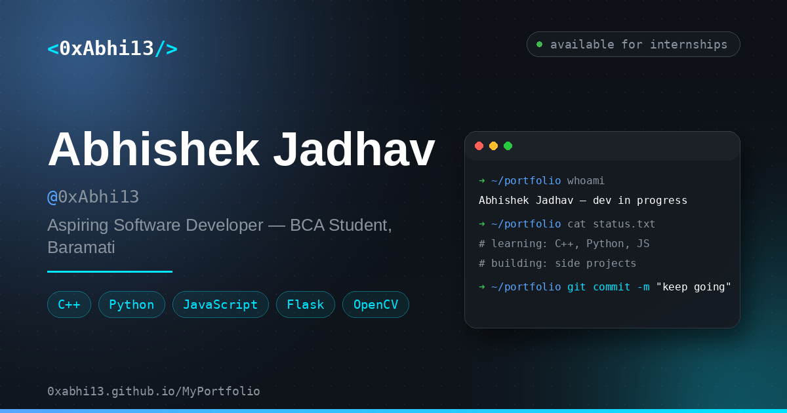

<div align="center">


<a href="https://0xabhi13.github.io/MyPortfolio/">
  
</a>

<p>
  <a href="https://0xabhi13.github.io/MyPortfolio/"></a>
  <a href="https://github.com/0xAbhi13/MyPortfolio"></a>
  <a href="https://github.com/0xAbhi13/0xBeatForge"></a>
  <a href="https://github.com/0xAbhi13/0xPDFForge"></a>
</p>

<p>
  
  
  
  
  
</p>




<sub>Baramati → World · BCA 2026 · C++ · Python · JavaScript · Single Window · 390×780 Phone · Wavecont 2:24</sub>

</div>

---

<div align="center">

### ⚡ How to *feel* it — 5 sec


| | | |
|:---:|:---:|:---:|
| **🖥️ Desktop** | **🪟 Window** | **💬 Ask Abhi** |
|  |  |  |
| Lottie boot · 56 dots · GSAP parallax | drag · 8-dir resize · dblclick fullscreen | 7 projects + 9 certs · no hallucination |
| `ABHISHEK` centered — never floats | `windowIn 0.38s` spring | `Ctrl+K` → search anywhere |

**Try:** `Double-click` icon → `Drag header` → `Double-click header` → `Ctrl+K` → `Ask “which uses Flask?”`

</div>

---

<div align="center">

### 🤖 Ask Abhi — ask, don't scroll


</div>

| Ask | Gets |
|:---|:---|
| `Who is Abhishek?` | BCA 2026 · Baramati · C++ Python JS |
| `Which uses Flask?` | 4 projects — Emotion / MagicSearch / AirCanvas / VoiceVision |
| `Verify Jio AI` | `nfJzfbmZP2Id` → Verify link |
| `bhai github kahan hai?` | Answers in Hindi/Marathi too |

<p align="center">
  
  
  
</p>

---

<div align="center">

### ✨ Motion — every pixel moves

</div>

<p align="center">
  
  
  
  
  
  
</p>

<div align="center">

| `particleCanvas 56 / 28` | `iconPulseGlow 2.8s` | `windowIn spring 0.34,1.56` |
|:---:|:---:|:---:|
| Unsplash + mesh + noise | 14× 96×96 SVG gradient `#8b5cf6→#4f46e5` | drag · 8-dir resize · dblclick max |

</div>

---

<div align="center">

### 🧩 Stack — no build, just craft


<br/>


<sub>Fonts `Syne 800` · `Inter` · `JetBrains Mono` · Colors `#050510` `#8b5cf6→#4f46e5` · Favicon briefcase `#2E90FA→#D946EF`</sub>

</div>

---

<div align="center">

### ⚡ Run — animated

</div>


```bash
git clone https://github.com/0xAbhi13/MyPortfolio.git
cd MyPortfolio
python -m http.server 8000  # → http://localhost:8000
# or just double-click index.html  (file:// works — audio crossOrigin='')
```


<details>
<summary><b>📂 Structure — click</b></summary>

```text
MyPortfolio/
├─ index.html          # OS shell — wallpaper + Lottie boot + 390×780 phone + search fix
├─ css/style.css       # windowIn 0.38s · pop 0.48s · iconPulse + searchRing 2.8s
├─ js/data.js          # 7 projects · 9 certs · playlist
├─ js/askAbhiKnowledge.js  # centralized v2.1
├─ js/app.js           # single-window · Spotlight (Ctrl+K) · 8-dir resize
└─ assets/  profile / projects / certifications (9) / icons (14) / audio wavecont.mp3
```

</details>

---

<div align="center">

### 👨‍💻 Abhishek Jadhav — 0xAbhi13

`Creative Developer` · `Baramati, Maharashtra` · `BCA 2026`

[](https://github.com/0xAbhi13)
[](https://linkedin.com/in/0xAbhi13)
[](mailto:contact.0xabhi13@gmail.com)


⭐ **Star if you liked the OS → try `Ctrl+K` and ask Abhi anything!**


<sub>Made with 💜 GSAP + Lottie + Tailwind — vanilla, no frameworks, just motion.</sub>


</div>
